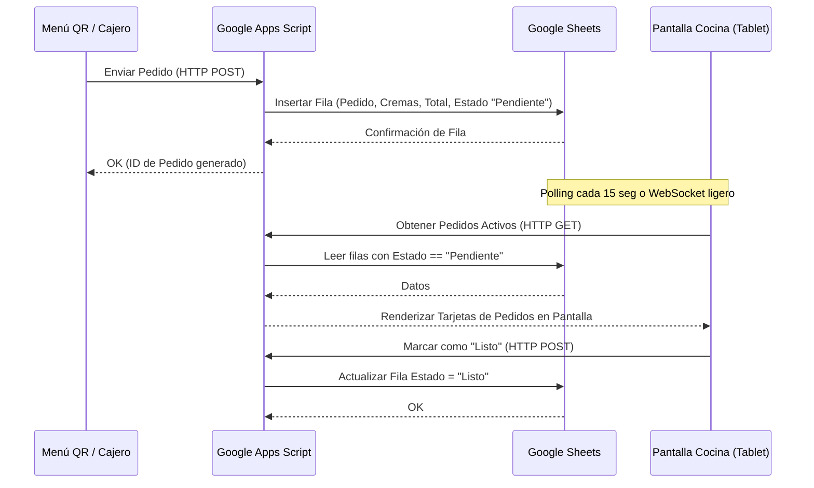

# ARQUITECTURA TÉCNICA: APLICACIÓN WEB DE CONTROL 💻🍳
## Sistema de Sincronización Caja-Cocina usando Google Sheets y Apps Script

Para mantener los costos mensuales del cliente en S/. 0.00 (lo cual te permite a ti embolsarte la suscripción de S/. 100 casi netos), utilizaremos una infraestructura basada en **Google Sheets** como base de datos en tiempo real y **Vercel** para el alojamiento gratuito del frontend.

---

## 1. FLUJO DE DATOS EN TIEMPO REAL



---

## 2. BACKEND CON GOOGLE APPS SCRIPT (CÓDIGO BASE)
Crea una macro en Google Sheets y pega este código básico para recibir los pedidos de la web y enviarlos a cocina:

```javascript
function doPost(e) {
  try {
    var data = JSON.parse(e.postData.contents);
    var sheet = SpreadsheetApp.getActiveSpreadsheet().getSheetByName("Pedidos");
    
    // Generar ID correlativo
    var lastRow = sheet.getLastRow();
    var orderId = lastRow === 0 ? 1 : lastRow;
    
    // Insertar datos del pedido
    sheet.appendRow([
      orderId,
      new Date(),
      data.nombre,
      data.pedidoDetalle, // Texto formateado
      data.cremas,
      data.tipo, // Recojo o Delivery
      data.metodoPago,
      data.total,
      "Pendiente" // Estado inicial
    ]);
    
    return ContentService.createTextOutput(JSON.stringify({
      status: "success",
      orderId: orderId
    })).setMimeType(ContentService.MimeType.JSON);
    
  } catch(error) {
    return ContentService.createTextOutput(JSON.stringify({
      status: "error",
      message: error.toString()
    })).setMimeType(ContentService.MimeType.JSON);
  }
}

function doGet(e) {
  var sheet = SpreadsheetApp.getActiveSpreadsheet().getSheetByName("Pedidos");
  var data = sheet.getDataRange().getValues();
  var pendingOrders = [];
  
  // Omitimos cabecera (i=1)
  for (var i = 1; i < data.length; i++) {
    if (data[i][8] === "Pendiente") {
      pendingOrders.push({
        id: data[i][0],
        fecha: data[i][1],
        nombre: data[i][2],
        detalle: data[i][3],
        cremas: data[i][4],
        tipo: data[i][5],
        pago: data[i][6],
        total: data[i][7]
      });
    }
  }
  
  return ContentService.createTextOutput(JSON.stringify(pendingOrders))
    .setMimeType(ContentService.MimeType.JSON)
    .setHeader("Access-Control-Allow-Origin", "*");
}
```

---

## 3. PANTALLA DE COCINA (FRONTEND SIMPLE)
En la subcarpeta de la app web, puedes crear un archivo HTML secundario llamado `cocina.html` que lea el `doGet` del Apps Script usando fetch y pinte bloques de pedidos como tarjetas con un gran botón rojo de **"COMPLETADO"**. Al presionar, hace una llamada POST a Apps Script para cambiar el estado a "Listo" y saca el pedido de la pantalla.

* **Recomendación de Hardware:** El dueño puede usar cualquier celular viejo o una tablet barata de S/. 200 colgada con soporte de pared en la cocina para este fin.
